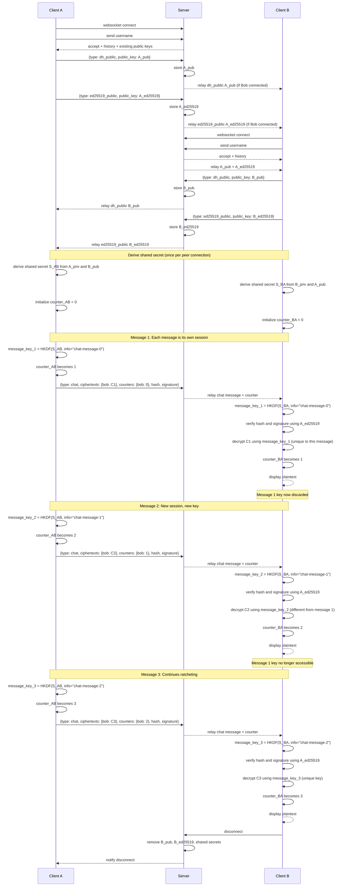

# Chat Exchange Sequence Diagram (Per-Message Session with Key Ratchet)

This diagram shows the updated exchange flow with per-message key derivation:
- WebSocket connect and username registration
- X25519 DH shared secret exchange (established once per peer connection)
- Ed25519 signing key sharing
- **Each message is treated as its own session with unique derived key**
- Per-message counter-based key ratcheting
- Verification + decryption with message-specific keys

**Key Security Properties:**
- Shared secret (S_AB, S_BA) established once per peer connection
- Each message derives a unique encryption key using counter-based KDF
- Compromising one message key does NOT expose other messages
- Old counters cannot decrypt new messages (forward secrecy)
- Message keys are ephemeral and discarded after use